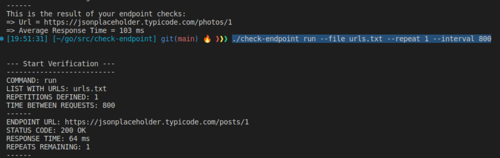
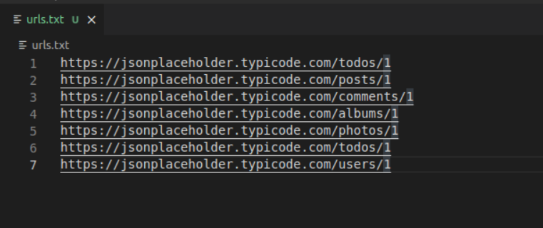
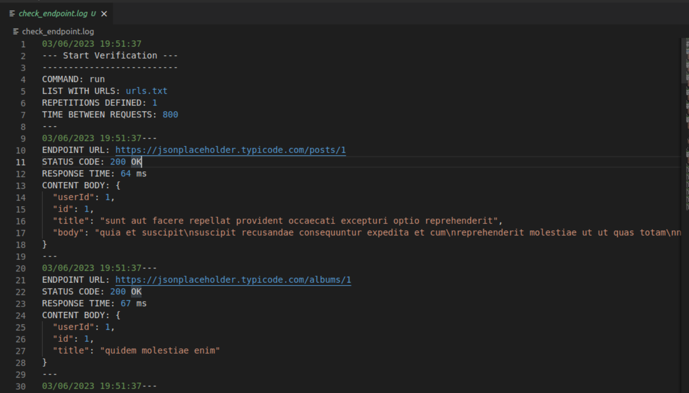

# Check-Endpoint
## Structure and technologies used
### What purpose?
> This command line application is built in Go, and is designed to collect information from specified endpoints into a .txt file and save the information to a log file.

> Users can enter one or more URLs (endpoints) and define the desired number of tests and times between each request. The app sends HTTP requests to the endpoints, recording the response time, HTTP status code, and response body content in a log file. At the end, information containing the response time averages for each endpoint and the success rate of the requests are presented.

### What was used?
- [Golang](https://go.dev/)
- [Package net](https://pkg.go.dev/net)
- [Package cli](https://pkg.go.dev/github.com/urfave/cli/v2)

### Basic structure:
- [package cli](/cli)
- [package controllers](/controllers)
- [package logs](/logs)
- [package images](/images)

### Basic usage:
> 
```
Linux

./check-endpoint run --file urls.txt --repeat 10 --interval 800

./check-endpoint run 
    --file (-f) <File containing list of URLs> 
    --repeat (-r) <Number of repetitions> 
    --interval (-i) <Time interval between requests (in milliseconds)>
```
> 



> 
```
Windows

.\check-endpoint run --file urls.txt --repeat 10 --interval 800

.\check-endpoint.exe run 
    --file (-f) <File containing list of URLs> 
    --repeat (-r) <Number of repetitions> 
    --interval (-i) <Time interval between requests (in milliseconds)>
``` 
>


### Urls file example:
>
> Avoid putting incorrect urls (without http:// or https://) and leaving blank lines between urls or below the last url.
>


### Logs sample:
>
> A file containing the logs (check_endpoint.log) will be created in the repository where the command is executed.
>


---
_end of README.md_j